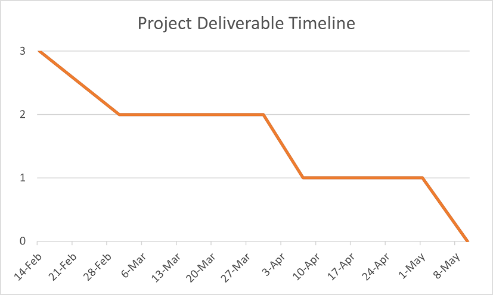
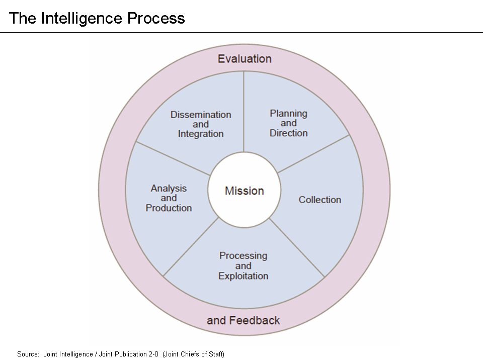

## Cyber Threat Intelligence Project- Milestone 1: Requirements analysis and planning (Project Proposal Stage)
---
- [Cyber Threat Intelligence Project- Milestone 1: Requirements analysis and planning (Project Proposal Stage)](#cyber-threat-intelligence-project--milestone-1-requirements-analysis-and-planning-project-proposal-stage)
- [Team Members](#team-members)
- [Executive Project Summary](#executive-project-summary)
- [Proposed project timeline](#proposed-project-timeline)
- [Risk list](#risk-list)
- [Project Methodology](#project-methodology)
    - [Literature Review](#literature-review)
    - [Technical Plan](#technical-plan)
- [Resources Needed](#resources-needed)
- [First Sprint Plan](#first-sprint-plan)

## Team Members

- Dillon Petschke
- John Kieran
- Josh Kelley

## Executive Project Summary
---
In today's ultra-connected business world, organizations can no longer afford to be reactive in their cybersecurity posture.  Emerging threats are discovered daily and adversaires often exploit 0-day vulnerabilities with increasing success.  A proactive response is needed to ensure all assets are sufficiently secured.  This project will explore and compile a framework to be applied in a multitude of scenarios to best protect an organization's most critical infastructure.

The goal of the project is to create an open source guide to creating an effective cyber threat intelligence (CTI) program for small and medium businesses. To do so, we will conduct a thorough analysis of prior works, and identify best practices, procedures, and issues. Once these have been identified we can create a 

In order to achieve this goal, we will utilize prior works in this sector, as well as, identify open source, value add tools that can provide threat intelligence to emerging CTI programs.

## Proposed project timeline
---

## Risk list
---
|Risk name (value)  | Impact     | Likelihood | Description |
|-------------------|------------|------------|-------------|
| Skillset limitations (32) | 4 | 8 | Due to the diverse nature of IT and Cybersecurity, some members of the group (all of us) may not have been exposed to different methodologies and techniques of conducting necessary tasks. In order to combat this, we will work together to learn as necessary to better the team as a whole. |
| Student availability (56) | 8 | 7 | Due to the team having professional careers and lives outside of CYBR8950, it is likely there will be scheduling limitation and conflicts that occur. This will lead to a major impact as the workload must be distributed evenly to be successful. |
| Open Source License Restrictions (48) | 6 | 8 | Open-source technologies while free to use individually, may have certain restrictions placed on them in the business environment. Seeing as this is the case we will identify those tools, and document the proper method of using the tool and alternatives that do not have this restriction. |
| Access to technological resources (21) | 3 | 7 | Given the scope of the project in CTI, it is likely we will not have access to a number of business grade tooling that would otherwise be available to the consumers of this guide. Given this we can identify Open-Source or Free work arounds to appropriately test and convery the success of this guide. |
| Lack of prior works (42) | 7 | 6 | As is standard for research related topics, there can exist a hole in relevant related works. In order to mitigate this risk, we will utilize a number of diverse sources of information includeing academic journals, blogs, websites, and books. |

## Project Methodology

#### Literature Review
---
The concept of Cyber Threat Intelligence as a preventive defense plan has attracted considerable attention across the industry in recent years.  Existing literature from corporate entities such as Lockheed Martin's [Cyber Kill Chain](https://www.lockheedmartin.com/en-us/capabilities/cyber/cyber-kill-chain.html) framework or Mandiant's [CTI Analyst Core Competencies Framework](https://www.mandiant.com/resources/blog/cti-analyst-core-competencies-framework) can provide a basis for a robust cybersecurity defense portfolio.  Additionally, academic efforts have also provided their own CTI frameworks, with [The Diamond Model](https://www.recordedfuture.com/blog/diamond-model-intrusion-analysis) as a prime example.  Other academic works include: [TINKER: A framework for Open source Cyberthreat Intelligence](https://arxiv.org/abs/2102.05571) and the [MITRE ATT&CK project](https://attack.mitre.org/ ) developed by the Massachusetts Institute of Technology, Research and Engineering group. 

Further supporting documents like the [Structured Threat Information Expression (STIX™)](https://docs.oasis-open.org/cti/stix/v2.1/cs01/stix-v2.1-cs01.html) from Oasis Open provide terminology and relational guidance when classifying potential threats. Additional open-source projects such as [TAXII](https://www.oasis-open.org/standard/taxii-version-2-1/ ) are also supported by Oasis Open and are repeatedly mentioned in cited works as an opportunity for automated intelligence collection. 

Government organizations have also developed best practices and recommendations, such as the Uk’s (CERT) Computer Emergency Response Team’s [whitepaper](https://www.ncsc.gov.uk/files/An-introduction-to-threat-intelligence.pdf) covering key concepts and strategies. Along with the United States (NSA) National Security Agency and their [V2 Cyber threat framework](https://media.defense.gov/2019/Jul/16/2002158108/-1/-1/0/CTR_NSA-CSS-TECHNICAL-CYBER-THREAT-FRAMEWORK_V2.PDF ). Additionally, the National Institute of Standards and Technology (NIST) guide to [cyber threat information sharing](https://nvlpubs.nist.gov/nistpubs/specialpublications/nist.sp.800-150.pdf) covers multiple topics around intelligence sharing and techniques. 

Multiple private sector or commercially publicized works are also available, such as Memcyco’s [threat intelligence framework](https://www.memcyco.com/home/cyber-threat-intelligence-framework/). Along with large corporations such as Microsoft, Google, Palo Alto, and others disclosing their own threat intelligence, threat actor reports, indicators of compromise, and more. 

#### Technical Plan 
---

1. Research and review relevant Cyber Threat Intelligence (CTI) documents, prior CTI program guides, tooling, and other relevant literature. This step will identify best practices, successful methodologies,  and valuable tools.
2. Conduct stakeholder analysis to identify the audience and their relevant needs to target needs based on organization size.
4. Utilizing the relevant literature, create solutions to documented issues with prior implementations of CTI program guides and best practices.
5. Build example automated tooling to ingest and aggregate CTI.
6. Create examples of CTI reports with actionable intelligence.
7. Create example recommendations based on available security tooling to execute actionable intelligence reports.
8. Create an official Cyber Threat Intelligence (CTI) Framework utilizing research findings, implementation best practices, documented examples of successful reporting, and document templates.

	

## Resources Needed
---

|Resource  | Dr. Hale needed? | Investigating Team member | Description |
|-------------------|---------|---------------------------|-------------|
| Open Source Intelligence Feeds | No | Dillon | Any worthwhile CTI will need actionable input.  We will need to source sufficiently useful input streams for framework's users.  The feeds will need to be free or low-cost to make the framework as approachable as possible. |
| Relevant Prior Literature | No | Team | We plan to build on prior industry knowledge and compile the best elements of each. |
| STIX/TAXII Standards | No | Josh | The STIX/TAXII nomenclature allows for improved threat sharing, better detection and response, bolstered collaboration, and enables automation in response to events. |

## First Sprint Plan
---

- Dillon Petschke
  - Continue research and review of relevant prior works.
  - Cite works appropriately and create annotations summarizing relevant and important findings.
  - Conduct stakeholder analysis to identify the audience and their relevant needs to target needs based on organization size.
    
- John
  - Continue research and review of relevant prior works.
  - Cite works appropriately and create annotations summarizing relevant and important findings. 

- Josh
  - Continue research and review of relevant prior works.
  - Cite works appropriately and create annotations summarizing relevant and important findings. 

- Finish Executive summary - Josh Dillion
- add to literature review - Josh Dillion John
- burn down chart - John

Example Centered Image HTML

    

Task
 - Identify Opensource CTI related tools that can be used
 - Identify Threat intelligence feeds that can be used
   - Cost/license agreement
   - https://www.apivoid.com/pricing/
   - https://otx.alienvault.com/api
 - Research Threat intelligence frameworks, identify issues/holes/implementation challenges/Cost
