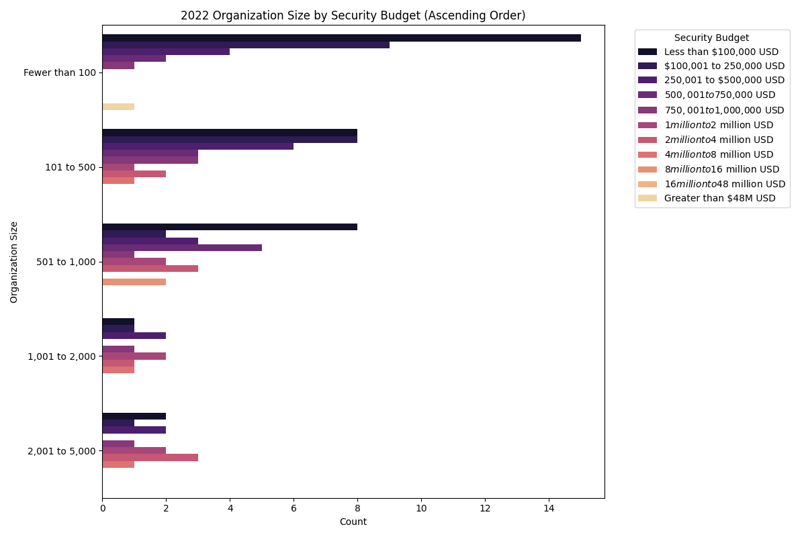
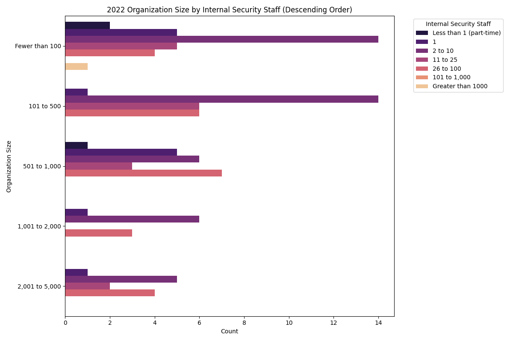
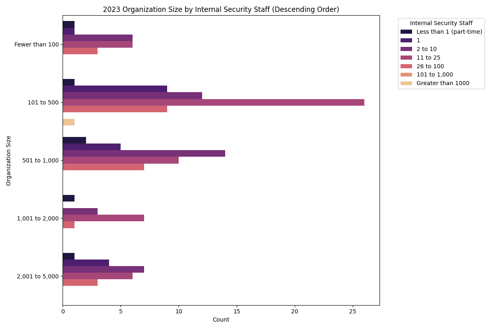

# Stake Holder Analysis

**Analysis**:

In order to properly scope the challenges our CTI guide will address and the recommendations we will provide, we must first identify who our audience is and the resources available to them. To do this, we have identified a good source for a cybersecurity "census," the SANs SOC Survey. While this data is not entirely representative of all businesses, it provides a good look into the size, resources, and capabilities of businesses that at least contain some security maturity level. 

We collected the data from the SANs SOC Survey from 2022 and 2023 to create our graphs for our analysis. The data points we addressed were organization size, security team size, and annual budgets. Our analysis lacks an accurate positional breakdown of the security team and a breakdown of annual budgets between software licenses, hardware, training, and people. This also does not consider the difference between new license and renewal budgets. 

Below are four graphs that break down organization size vs. annual security budgets and organization size vs. security team size—the data from 2022 and 2023. 

**SANs Data Graphs**:

	

	

	

	

**Findings**: 

This report is intended for IT staff with a focus on cybersecurity obligations in addition to personnel in a security analyst, security engineer, architect, or cybersecurity manager role. It has been designed specifically for organizations that have little or zero financial budget designated for Cyber Threat Intelligence goals, however, still want to improve their intelligence capabilities. 

The suggested development and operational tasks in this report are designed to reduce hands-on responsibilities and recommend automation wherever possible. This CTI model makes the assumption that most organizations do not have full-time equivalent staff available, and this model must be able to operate with limited maintenance or dedicated resources. 

This guide is technical in nature but is written to benefit readers of all cybersecurity experience levels. Organizations may implement the entire framework as written or adopt individual pieces as needed to meet their needs. 

**Citations**: 

Crowley, C., Filkins, B., & Pescatore, J. (2024, March 13). SANS 2023 SOC Survey. SANS Institute. https://www.sans.org/white-papers/2023-sans-soc-survey/ 